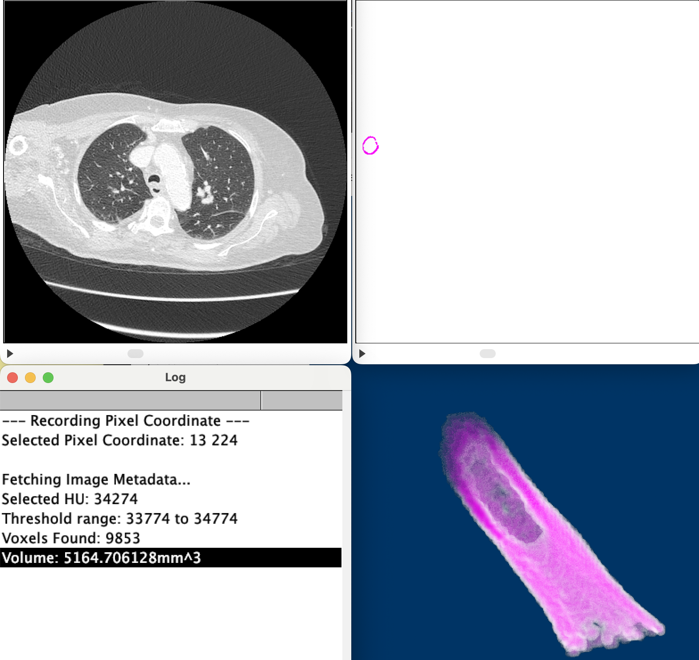
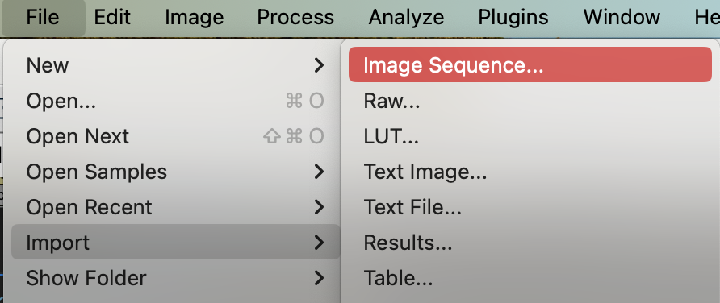
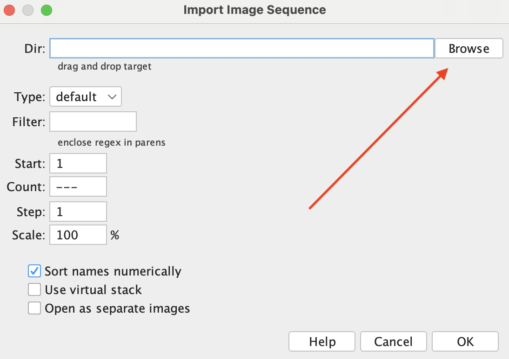
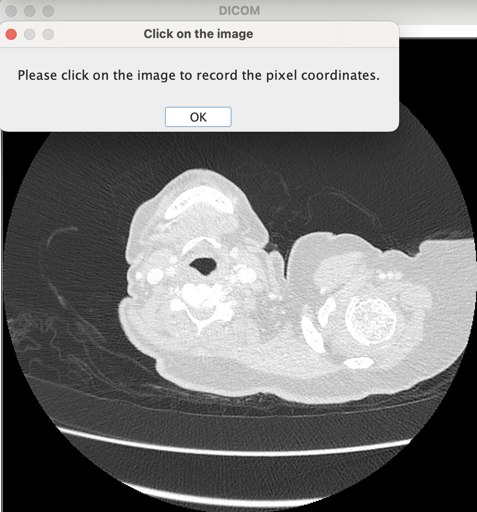
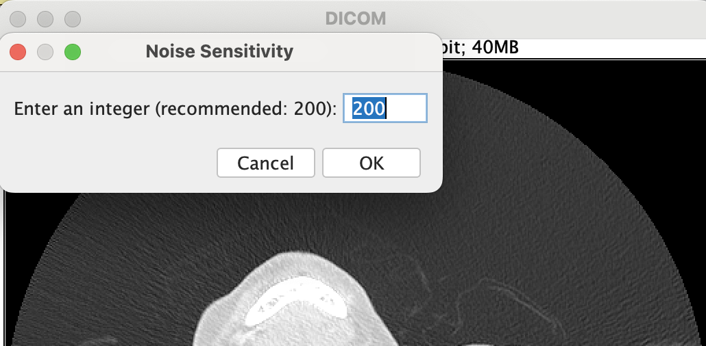
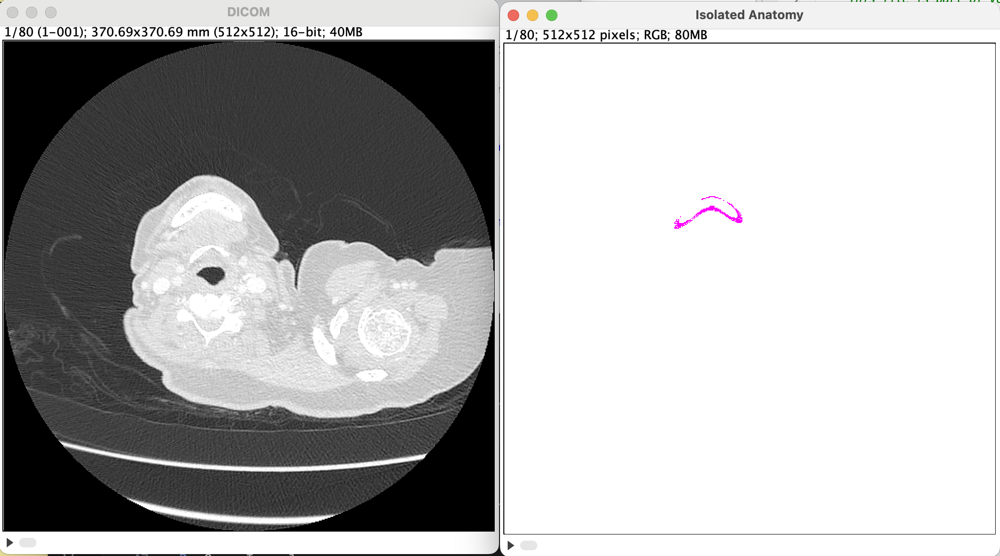

# Table of Contents
1. [Introduction](#introduction)
2. [PlugIn Requirements](#requirements)
    1. [How to Open a CT Scan in FIJI ImageJ](#open_a_ct_scan)
4. [PlugIn Installation](#plugin_installation)
5. [Instructions](#instructions)
    1. [Threshold](#threshold_desc)
6. [Future Directions](#future_directions)
7. [Contribution](#contribution)
8. [Contact](#contact)
9. [License Information](#license_information)
10. [Conclusion](#conclusion)

## Introduction 

Welcome to the Volumetric Analysis in Medicine!

This software is designed specifically for physicians and researchers, enabling the user to select and visualize anatomical structures on a CT scan and calculate their volume with ease.

VolumetricAnalysis_Medicine intends to provide a greater ability to analyze and describe complex patient anatomy. For the latter, this tool allows the user to describe the selected anatomy, such as but not limited to volume, cubic volume, and dimensions.

## PlugIn Requirements 

This PlugIn operates in FIJI Is Just ImageJ, which can be downloaded [here](https://imagej.net/software/fiji/downloads). This PlugIn *requires a stack* (ie a series of 2D images, called slices, that represent a volume). To open a stack or image sequence in FIJI ImageJ, follow the steps below.

These files *must* be in DICOM (.dcm) format (this is standard in medicine). The code is able to function on any type of anatomic scans (transverse, sagittal, and coronal scans).

### Open a CT Scan 

1. Click on the following sequence, as shown in the image below
    - File > Import > Image Sequence

2. Use the "Browse" button in the pop up to locate the **folder** containing the file sequence.

3. Select "Ok"

## PlugIn Installation 
1. Download the file as a .jar file
2. Open ImageJ
3. Navigate to PlugIns > Install...
4. Select the downloaded JAR file
5. Install it into the PlugIn folder

## Instructions for Use 
1. Open CT scan in ImageJ 
2. Run the PlugIn and follow prompts
    - You will be prompted to first select a point on the anatomical structure you wish to analyze
    
    - Click this point on the CT scan
    - Select a threshold
    
3. Time to run depends exponentially on the volume of the structure

### Threshold 
Radio density can vary based on subtle differences. Therefore, the threshold parameter allows you to specify the tolerance of the program and provide a range of radiodensity values accepted by the algorithm. See [this link](https://radiopaedia.org/articles/hounsfield-unit?lang=us) for more information on radiodensity.

## Future Directions 
Future updates will focus on improving the algorithm's run time for larger structures and streamlining the code. Additionally, a 3D viewer will be integrated within the program.

## Contribution 
If you would like to contribute software or advice on future directions, please reach out using the contact information in the following section

## Contact 
For support, comments, or feedback, please contact the author:
> Jonathan Collard de Beaufort \
> jonathancdb@gmail.com \
> Syracuse University, BS '25 \
> SUNY Upstate Medical School, MD '29

## License 
This software is licensed under the GNU General Public License. See the LICENSE file for more details.

Thank you for using VolumetricAnalysis_Medicine. We hope it enhances your medical practice and research.
